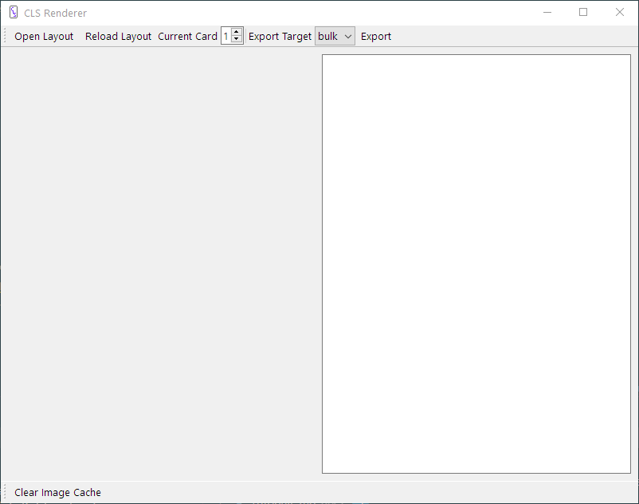

# Quick Ref

This document is meant to show all the syntax of brikWork in a smaller, yet more complete way than the tutorial. It's also easier to read than the full Syntax Reference.

## Sections

Sections are made up of a name with contents surrounded by curly braces, like this

    name {
        #contents go here
    }

Generally contents are properties. Properties are a name, a colon, and a value

    size: 1in, 1in

The value ends either at the end of the line or with a semicolon.

    x: center; width: 1/2in

The whitespace (spaces and tabs) around names and values is ignored, so that width will be "1/2in" not " 1/2in". Whitespace within values is kept however.

The `briks` and `data` sections have different contents. The `briks` section uses definition syntax, which is just property syntax using equals instead of colons. See the [briks section page](../Special-Sections/#the-briks-section) for more information. The `data` section uses CSV format, with either standard, excel-style syntax or brikWork syntax which uses escapes to put commas in values, and ignores headers with no name.

    briks {
        this-thing = some value I guess??
    }
    data {
    foo, bar
    [this-thing], I don't even know\, do you?
    }

The `export` section and element sections can also feature subsections

    export {
        pdf {
            name: more-cards.pdf
        }
    }

    stats {
        attack {
        }
        defense {
        }
    }

## Elements

There are 6 types of elements

 - `text` elements draw text both, simple and complex, and have access to a limited amount of HTML
 - `image` elements draw images quickly and easily, best when one image will be used on every card
 - `image-box` elements draw images according to an alignment, best when you have lots of images of different sizes
 - `rect` elements draw rectangles, this is great for prototyping or drawing a bounding box to see what a given size would be
 - `circ` elements draw circles
 - `line` elements draw lines

Elements can also have subelements, which are drawn relative to their parent

    container {
        subelement {
            type: text
            text: I'm drawn from the upper left of my container!
        }
    }

## Briks

Briks feature a name surrounded by square brackets with optional arguments separated by vertical bars.

    [column name]
    [substr| [next column] | 1| 1]

Most briks you'll use will likely be column briks or user briks. Briks are evaluated recursively, if a brik returns a brik then that brik will be evaluated too.

## Comments

Comments must be on their own line and begin with a pound sign

    # this is a comment

Comments can appear in any section. 

## Values

A value is anything that can be assigned to a property or given to a brik as an argument. Type of values are numbers, toggles, colors, and strings.

### Numbers

Numbers take three basic forms, a whole number, a decimal, or a fraction

    45
    2
    .3
    1.45
    3/4
    1 1/8

Depending on the property or brik, numbers can have signs and units

    -45
    1 1/3in

### Toggles

A toggle is a true or false value. There are three values for each true and false, the idea being some read better than others with different properties.

    true
    yes
    on

    false
    no
    off

### Colors

A color is one of

 - a hex code, either 6 digit #RRGGBB for opaque colors, or ##AARRGGBB for transparent colors
 - a named SVG color name, like `blue` or `yellow`
 - the color `transparent`

### Strings

Strings are everything else. The fixed values for `align` and `decoration`, the path for `source` and the value for `text` are all strings. Strings also allow escapes, which is using a back slash before a character to show it isn't part of the syntax

    text: This is good!\[not it's not -ED\]

Four escapes have special meaning

Escape | Meaning | Escape | Meaning
------ | ------- | ------ | -------
`\n` | a new line | `\s` | a space
`\t` | a tab | `\\` | a literal backslash

The space and tab escapes are useful for putting whitespace at the edge of a value.

## Using the App

The open button opens a new layout file and generates it.

The reload button reloads and regenerates the last loaded layout.

The current card spinner shows and changes the currently shown card.

The export target combo box selects which export target you want.

The export button exports the cards according to the export target.

The card is shown on the left, and on the right is a text box for displaying errors. Errors should be readable but if you have trouble trying to decipher them please ask on the brikWork forum, located from the [homepage](https://codlark.itch.io/brikWork).