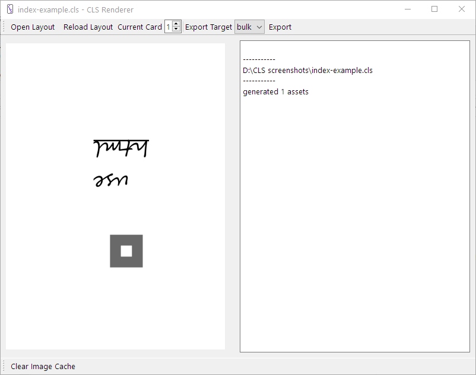

# Introduction to Card Layout Script

Card Layout Script (CLS) is a language for designing cards. Cards are described as layouts that are rendered by the CLR Renderer.

Use CLS to make cards and things for print-n-play games, prototyping board games, video games, or just to jazz up your favorite TTRPG.

CLS was made because the two main card programs I used both felt lacking. The venerable nanDECK can do most anything, but the arcane syntax and the clinical documentation make it a hard to learn. The WYSIWYG [CardMaker](https://github.com/nhmkdev/cardmaker) is easy to use, but it's limitations felt stifling at times.  So I made a language and renderer that did what I wanted it to, and added some other handy features along the way. Current features

  -  CSS-like syntax familiar to most programmers
  -  Easy to learn and powerful placement system that allows positions to be specified from any direction, and relative to other elements
  -  Unitized numbers in pixels, inches, millimeters, and more
  -  Text with complex character support, preliminary testing shows Arabic and Devanagari work but I’d love to hear from people who actually use these alphabets
  -  Text can be structured and styled with HTML
  -  Beginner friendly documentation that doesn’t expect you to already know how things work, with handy tutorials
  -  Layouts can specify other layouts as templates and use their settings and elements, allowing you to make multiple layouts that share features
  -  A suite of macros that allow you to program your layouts with simple functions like math and string manipulation, and more complex programming with conditions and lists
  -  Cards can be exported to single images, print ready PDF files, or images for Tabletop Simulator

## How it works
Write a layout file like this one

    layout {
        size: 2.5in, 3.5in
    }
    label {
        type: text
        position: 1in, 1in
        size: 1in, 1in
        angle: 180
        font: 55pt, Segoe Script
        align: right, bottom
        text: use <u>html</u>
    }
    box {
        type: rect
        position: ^1in, ^1in
        line: 1/8in, #696969
        fill-color: transparent
    }

in your favorite editor (there's a plugin for VS Code) and give it to the CLS Renderer to see how it looks.

From there you can export your cards to individual images, a texture image for Tabletop Simulator, or a PDF for print and play.

Download the CLR Renderer from the home page at [codlark.itch.io/CLS](https://codlark.itch.io/CLS) then take a look at the [tutorial](./Tutorial.md).

:::{toctree}
:caption: Tutorials
:maxdepth: 2
:hidden:
Tutorial
Tutorial2
Tutorial3
:::
:::{toctree}
:caption: Reference
:maxdepth: 2
:hidden:
Quick-Ref
Special-Sections
Export-Section
Elements-and-Properties
Macros
Glossary
:::
:::{toctree}
:caption: Technical Stuff
:maxdepth: 2
:hidden:
Syntax
changelog
:::
:::{toctree}
:caption: Links
:maxdepth: 2
:hidden:
Home Page <https://codlark.itch.io/cls>
VS Code Extension <https://marketplace.visualstudio.com/items?itemName=codlark.CLS-vscode>
:::